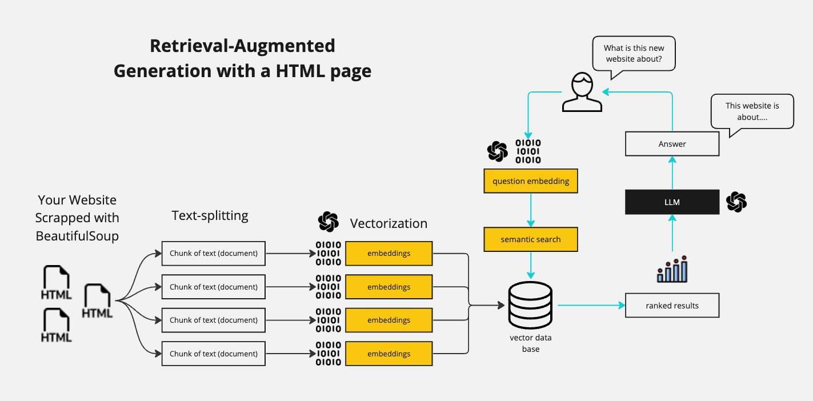

# Chat with a Website from URL - LangChain Chatbot with Streamlit GUI

Welcome to the GitHub repository for the LangChain Chatbot with Streamlit GUI! This project is a comprehensive guide to building a chatbot capable of interacting with websites, extracting information, and communicating in a user-friendly manner. It leverages the power of LangChain 0.1.0 and integrates it with a Streamlit GUI for an enhanced user experience.

🟡 This repository is meant as supporting material for the [Youtube video tutorial](https://youtu.be/bupx08ZgSFg).

## Features
- **Website Interaction**: The chatbot uses the latest version of LangChain to interact with and extract information from various websites.
- **Large Language Model Integration**: Compatibility with models like GPT-4, Mistral, Llama2, and ollama. In this code I am using GPT-4, but you can change it to any other model.
- **Streamlit GUI**: A clean and intuitive user interface built with Streamlit, making it accessible for users with varying levels of technical expertise.
- **Python-based**: Entirely coded in Python.

## Brief explanation of how RAG works

A RAG bot is short for Retrieval-Augmented Generation. This means that we are going to "augment" the knowledge of our LLM with new information that we are going to pass in our prompt. We first vectorize all the text that we want to use as "augmented knowledge" and then look through the vectorized text to find the most similar text to our prompt. We then pass this text to our LLM as a prefix.

This is more clearly explained in the [Youtube video tutorial](https://youtu.be/bupx08ZgSFg), but here is a diagram that shows the process:



## Installation
Ensure you have Python installed on your system. Then clone this repository:

```bash
git clone [repository-link]
cd [repository-directory]
```

Install the required packages:

```bash
pip install -r requirements.txt
```

Create your own .env file with the following variables:

```bash
OPENAI_API_KEY=[your-openai-api-key]
```

## Usage
To run the Streamlit app:

```bash
streamlit run app.py
```

## Contributing
This repository is meant as supporting material for the [Youtube video tutorial](https://youtu.be/bupx08ZgSFg). Therefore, I am not accepting any pull requests unless they are for fixing bugs or typos.

## License
This project is licensed under the MIT License - see the LICENSE file for details.

---

**Note**: This project is for educational and research purposes. Ensure to comply with the terms of use and guidelines of the utilized APIs and services.

---

I hope this repository helps you in your journey of exploring AI and chatbot development. For more information and tutorials, check out [Your YouTube Channel].

Happy Coding! 🚀👨‍💻🤖

---

*Don't forget to star this repo if you find it useful!*

---